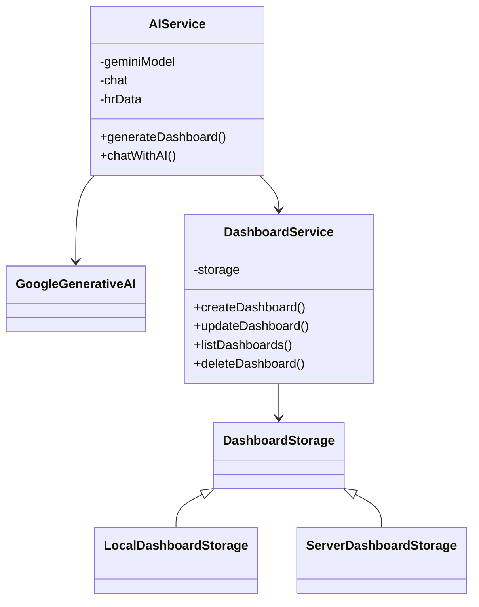

# AI Dashboard Feature Documentation

## Overview

The AI Dashboard feature provides an intelligent, automated way to generate and manage HR analytics dashboards using AI capabilities from Google's Gemini and Anthropic's Claude APIs. This system allows users to create data-driven visualizations and insights from HR data through natural language prompts.

## Implementation Status

### Completed Features ✅

1. **AI Service Integration**
   - Dual API support (Gemini and Claude)
   - Configurable provider selection
   - Robust error handling
   - HR data context generation
   - API key validation

2. **Chat Interface**
   - Real-time HR data querying
   - Multi-turn conversations
   - Persistent chat history
   - Modern UI with Material Design
   - Loading states and error handling

3. **Dashboard Storage**
   - Local storage implementation complete
   - CRUD operations for dashboards
   - Dashboard duplication support
   - Version tracking

### In Progress 🚧

1. **AI-Powered Dashboard Generation**
   - Basic structure implemented
   - Needs component generation logic
   - Layout optimization pending

2. **Server Storage**
   - Interface defined
   - Implementation placeholder ready
   - Actual server integration pending

### Pending Features ⏳

1. **Advanced Visualization**
   - Custom component templates
   - Real-time data updates
   - Enhanced filtering capabilities

2. **Dashboard Sharing**
   - Multi-user support
   - Permission management
   - Collaboration features

## Technical Architecture

### Service Layer


### Data Flow

1. **Dashboard Generation**
   ```
   User Prompt → AIService → Gemini/Claude API → JSON Response → Dashboard Object → Storage
   ```

2. **Chat Interaction**
   ```
   User Message → AIService → Chat Instance → System Context → AI Response → User Interface
   ```

## Implementation Details

### 1. Dashboard Structure
```typescript
interface CustomDashboard {
  id: string;
  name: string;
  description: string;
  components: DashboardComponent[];
  createdAt: Date;
  updatedAt: Date;
  isAIGenerated: boolean;
  prompt?: string;
}

interface DashboardComponent {
  id: string;
  type: 'chart' | 'metric' | 'table';
  config: DashboardComponentConfig;
  layout: DashboardComponentLayout;
}
```

### 2. AI Integration

#### Gemini Implementation
```typescript
const geminiModel = genAI.getGenerativeModel({ 
  model: GEMINI_MODEL 
});

const chat = geminiModel.startChat({
  history: [],
  generationConfig: {
    temperature: 0.8,
    maxOutputTokens: 2048,
  },
});
```

#### Claude Implementation
```typescript
const response = await fetch(CLAUDE_API_URL, {
  method: 'POST',
  headers: {
    'Content-Type': 'application/json',
    'anthropic-version': '2024-02-29',
    'x-api-key': apiKey
  },
  body: JSON.stringify({
    model: 'claude-3-sonnet-20240229',
    messages: [...]
  })
});
```

## Testing Strategy

> **Note**: For detailed testing documentation, refer to:
> - [Test Architecture Documentation](./TEST_ARCHITECTURE.md)
> - [Mock Implementations Guide](./MOCK_IMPLEMENTATIONS.md)

### 1. Mock Implementation
```typescript
jest.mock('@google/generative-ai', () => ({
  GoogleGenerativeAI: class {
    getGenerativeModel() {
      return {
        startChat: () => mockChat,
        generateContent: () => mockContent
      };
    }
  }
}));
```

### 2. Test Coverage
- Dashboard generation flow
- Chat initialization and interaction
- Storage operations
- Error handling
- API response validation

### 3. Key Testing Documents

#### Test Architecture Document
Contains:
- Complete test architecture overview
- Service class diagrams
- Data flow documentation
- Known issues and solutions
- Testing guidelines

#### Mock Implementations Guide
Contains:
- Detailed mock implementation patterns
- Evolution of mocking strategy
- Common issues and solutions
- Best practices for mocks
- Implementation examples

### 4. Testing Best Practices
Refer to the detailed documentation for:
- Mock setup and initialization
- Response chain handling
- Error scenario testing
- Storage strategy implementation
- Test isolation techniques

## Best Practices

### 1. Dashboard Generation
- Include comprehensive HR context
- Validate component structure
- Handle API errors gracefully
- Maintain consistent response format

### 2. Chat Interaction
- Initialize with system context
- Maintain conversation history
- Handle multi-turn interactions
- Validate response structure

### 3. Data Management
- Use storage strategy pattern
- Implement proper error handling
- Maintain data consistency
- Handle async operations correctly

## Configuration

### Environment Variables
```
GEMINI_API_KEY=your-gemini-api-key
CLAUDE_API_KEY=your-claude-api-key
USE_GEMINI=true
```

### API Configuration
```typescript
const GEMINI_MODEL = 'gemini-pro';
const CLAUDE_API_URL = 'https://api.anthropic.com/v1/messages';
```

## Error Handling

### Common Error Scenarios
1. Invalid API responses
2. JSON parsing errors
3. Storage failures
4. Network issues

### Error Recovery
1. Retry mechanisms
2. Fallback options
3. User feedback
4. Error logging

## Future Enhancements

### Planned Features
1. Advanced visualization options
2. Custom component templates
3. Real-time data updates
4. Enhanced error recovery
5. Advanced filtering capabilities

### Technical Improvements
1. Response caching
2. Performance optimization
3. Enhanced type safety
4. Improved test coverage

## Troubleshooting Guide

### Common Issues
1. **Invalid Dashboard Generation**
   - Check API response format
   - Validate component structure
   - Verify HR data context

2. **Chat Initialization Failures**
   - Verify API keys
   - Check system prompt
   - Validate chat instance

3. **Storage Issues**
   - Clear localStorage
   - Check storage implementation
   - Verify data structure

### Debug Steps
1. Enable verbose logging
2. Check API response structure
3. Validate storage state
4. Review error messages 

## Related Documentation

### Technical Documentation
- [Test Architecture](./TEST_ARCHITECTURE.md)
  - Complete test architecture overview
  - Service class diagrams
  - Data flow documentation
  - Testing guidelines

- [Mock Implementations](./MOCK_IMPLEMENTATIONS.md)
  - Detailed mock implementation patterns
  - Evolution of mocking strategy
  - Common issues and solutions
  - Implementation examples

### Additional Resources
- Jest Configuration
- Test Setup Files
- CI/CD Integration
- Test Coverage Reports 

## Next Steps as of 02/05/2025 10:00 AM

1. **Dashboard Generation**
   - Implement component generation logic
   - Add layout optimization algorithms
   - Create component templates

2. **Server Integration**
   - Implement ServerDashboardStorage
   - Add authentication layer
   - Set up API endpoints

3. **Enhanced Visualization**
   - Add more chart types
   - Implement real-time updates
   - Add advanced filtering

4. **Testing**
   - Add unit tests for AI service
   - Add integration tests
   - Implement E2E testing 

## Enhanced Filtering System (Added 02/05/2025 11:55AM)

### Overview
The AI Dashboard now supports comprehensive data filtering capabilities through a flexible `DashboardFocus` system. This enhancement allows for precise data visualization based on multiple criteria.

### Filter Types
```typescript
interface DashboardFocus {
  department?: string;
  subDepartment?: string;
  specialty?: string;
  position?: string;
  division?: string;
  salaryRange?: {
    min: number;
    max: number;
  };
}
```

### Implementation Details

1. **Filter Detection**
   ```typescript
   // Example of filter extraction from user prompt
   const departmentMatch = prompt.match(/\b(Engineering|Art|Marketing|HR|Finance|Admin|BOD|Management)\b/i);
   const specialtyMatch = prompt.match(/specialty:\s*"([^"]+)"/i);
   const positionMatch = prompt.match(/position:\s*"([^"]+)"/i);
   const divisionMatch = prompt.match(/division:\s*"([^"]+)"/i);
   const salaryRangeMatch = prompt.match(/salary(?:\s+range)?:\s*(\d+)k?\s*-\s*(\d+)k?/i);
   ```

2. **Data Filtering**
   - Pre-filters data before AI processing
   - Applies multiple filter criteria simultaneously
   - Maintains data consistency across all visualizations

3. **Visual Feedback**
   - Dynamic dashboard title reflecting active filters
   - Filter chips showing current criteria
   - Automatic updates to all charts and metrics

### Usage Examples

1. **Department Focus**
   ```
   "Show me Engineering department dashboard"
   ```

2. **Specialty Filter**
   ```
   "Show metrics for specialty: 'Frontend Development'"
   ```

3. **Position Analysis**
   ```
   "Compare salaries for position: 'Senior Developer'"
   ```

4. **Division Overview**
   ```
   "Analyze division: 'Technology'"
   ```

5. **Salary Range**
   ```
   "Show employees in salary range: 50k - 100k"
   ```

6. **Combined Filters**
   ```
   "Show me Engineering department dashboard for specialty: 'Frontend Development' with salary range: 80k-120k"
   ```

### Architecture

1. **Filter Processing**
   - `AIService`: Extracts and validates filter criteria
   - `DashboardFocus`: Type-safe filter structure
   - `AIDashboard`: Applies filters to visualizations

2. **Data Flow**
   ```
   User Prompt → Filter Extraction → Data Pre-filtering → AI Processing → Filtered Dashboard
   ```

3. **Component Updates**
   - Memoized filtering logic for performance
   - Real-time filter application
   - Automatic component re-rendering

### Best Practices

1. **Filter Application**
   - Apply filters at the data source level
   - Use case-insensitive comparisons
   - Handle missing or undefined values gracefully

2. **Performance**
   - Memoize filtered results
   - Apply filters in order of specificity
   - Cache frequently used filter combinations

3. **User Experience**
   - Clear visual indication of active filters
   - Easy filter removal/modification
   - Consistent filter behavior across components

### Future Enhancements

1. **Planned Features**
   - Advanced filter combinations
   - Custom filter definitions
   - Filter templates and presets
   - Filter history and favorites

2. **Technical Improvements**
   - Filter persistence
   - Filter validation rules
   - Filter performance optimization
   - Advanced filter matching patterns

### Key Files

1. **`src/types/dashboard.ts`**
   - Defines `DashboardFocus` interface
   - Type definitions for filter structure
   - Dashboard component types

2. **`src/components/dashboard/AIDashboard.tsx`**
   - Implements filter UI components
   - Handles filter state management
   - Applies filters to visualizations

3. **`src/services/ai.ts`**
   - Extracts filters from user prompts
   - Pre-filters data for AI processing
   - Generates filtered dashboard configurations

### Testing Considerations

1. **Unit Tests**
   - Filter extraction accuracy
   - Filter combination behavior
   - Edge case handling

2. **Integration Tests**
   - Filter application across components
   - Data consistency
   - Performance impact

3. **User Experience Tests**
   - Filter discoverability
   - Filter feedback clarity
   - Filter interaction patterns 