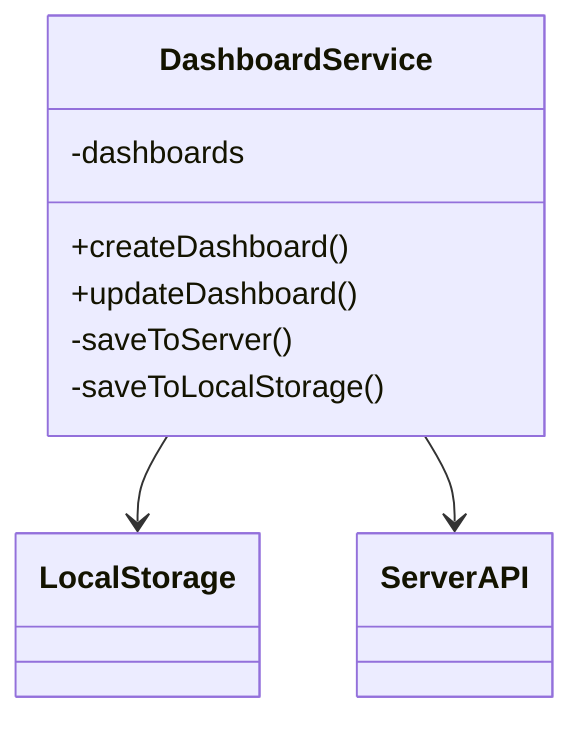
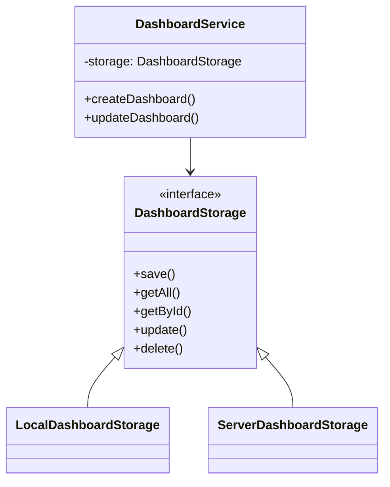
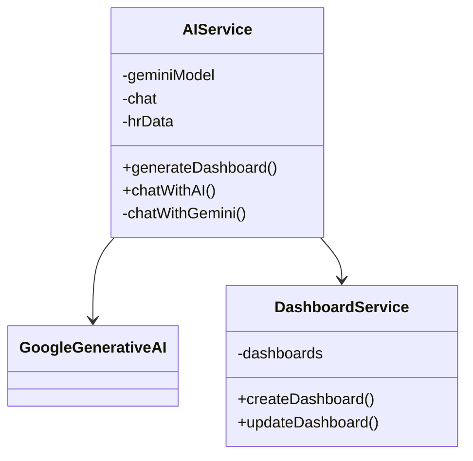
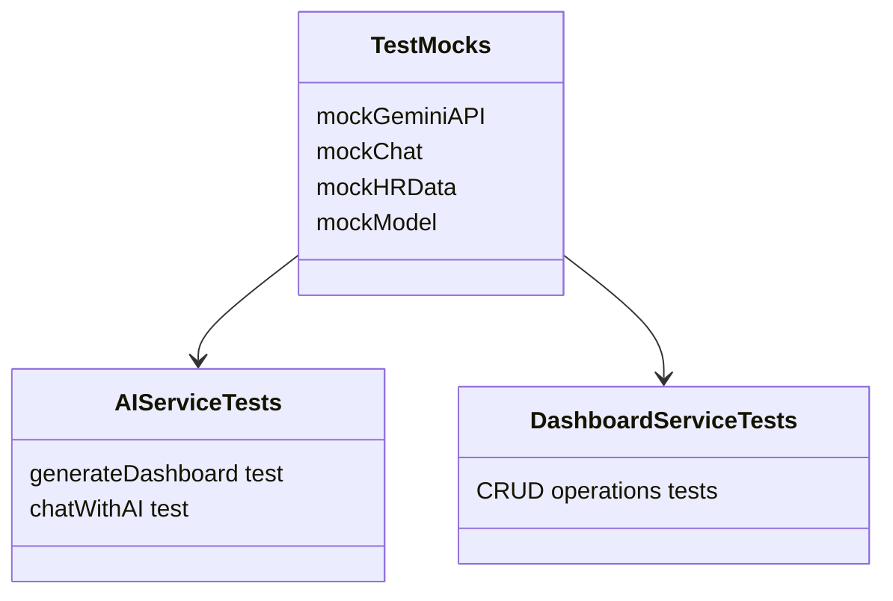

# Test Architecture Documentation

## Overview

This document outlines the test architecture for the AI and Dashboard services, focusing on mock implementations and test structures.

## Evolution of Architecture

### Initial Architecture (Failed)


### Revised Architecture (Successful)


## Key Changes

### 1. Storage Strategy Pattern
- Introduced `DashboardStorage` interface
- Separated storage implementations (Local/Server)
- Simplified testing through dependency injection
- Eliminated complex mocking requirements

### 2. Failed Approaches
1. **Direct API Mocking**
   - Attempted to mock `fetch` responses
   - Led to inconsistent behavior
   - Complex error handling
   - Difficult to maintain

2. **Response Chain Mocking**
   - Tried mocking response objects
   - Issues with `ok` property
   - Incomplete mock implementations
   - Test failures due to undefined properties

3. **Dual Storage Approach**
   - Attempted to handle both local and server storage simultaneously
   - Led to race conditions
   - Complex error recovery
   - Difficult to test edge cases

### 3. Successful Solution
1. **Storage Abstraction**
   - Clear interface definition
   - Pluggable storage implementations
   - Single responsibility principle
   - Easy to test in isolation

2. **Test Configuration**
   - Tests use local storage by default
   - No network dependencies
   - Predictable behavior
   - Easy to verify state

## Testing Guidelines

### Dashboard Service Tests
1. **Storage Selection**
   ```typescript
   // Use local storage for tests
   const service = new DashboardService(true);
   ```

2. **State Management**
   ```typescript
   beforeEach(() => {
     localStorage.clear();
     jest.clearAllMocks();
   });
   ```

3. **Assertions**
   - Focus on data integrity
   - Verify state changes
   - Check date handling
   - Validate IDs

### AI Service Tests
1. **Mock Setup**
   - Use Jest module mocking
   - Mock Gemini API responses
   - Simulate chat interactions

2. **Response Validation**
   - Verify generated content
   - Check response formatting
   - Validate dashboard structure

## Best Practices

1. **Storage Strategy**
   - Use dependency injection
   - Test with local storage
   - Mock external services
   - Keep implementations separate

2. **Test Isolation**
   - Clear state between tests
   - Use independent storage instances
   - Avoid shared state
   - Clean up after each test

3. **Error Handling**
   - Test error scenarios
   - Verify error messages
   - Check state recovery
   - Validate error propagation

## Service Architecture

### Main Service Classes



### Test Structure



## Data Flow

### Dashboard Generation Flow
1. `aiService.generateDashboard(prompt)`
2. `geminiModel.generateContent(dashboardPrompt)`
3. `result.response.text()`
4. `JSON.parse(response)`
5. `validateDashboardResponse(dashboardConfig)`

### Chat Flow
1. `aiService.chatWithAI(message)`
2. `chat.sendMessage(systemPrompt)` // First call with instructions
3. `chat.sendMessage(userMessage)`  // Second call with actual message
4. `result.response.text()`

## Mock Implementations

### Current Structure
```typescript
mockModel = {
  startChat: () => mockChat,
  generateContent: () => ({
    response: {
      text: () => Promise.resolve(JSON.stringify({...}))
    }
  })
};

mockChat = {
  sendMessage: () => ({
    response: {
      text: () => Promise.resolve('Mock response')
    }
  })
};
```

### Expected Response Structures

#### Dashboard Generation Response
```typescript
{
  name: string;
  description: string;
  isAIGenerated: boolean;
  components: [{
    id: string;
    type: 'chart' | 'metric' | 'table';
    config: {
      title: string;
      dataSource: {
        type: string;
        metric?: string;
      };
    };
    layout: {
      x: number;
      y: number;
      w: number;
      h: number;
    };
  }];
}
```

#### Chat Response
```typescript
{
  response: {
    text: () => Promise<string>
  }
}
```

## Known Issues

1. **Mock Consistency**
   - Mock implementations must return the same structure as real APIs
   - Response chains need proper Promise handling
   - JSON responses must be valid and match expected interfaces

2. **Response Chain Requirements**
   - `generateContent()` must return object with `response`
   - `response.text()` must return Promise with string
   - Dashboard generation requires valid JSON string
   - Chat responses can be plain text

3. **Chat Initialization**
   - Chat mock must handle two sequential calls:
     - First: System instructions
     - Second: User message
   - Each call must maintain proper response structure

## Best Practices

1. **Mock Setup**
   - Initialize mocks before service creation
   - Clear mocks between tests
   - Use `beforeEach` for consistent test state

2. **Response Handling**
   - Always return Promises for async operations
   - Maintain consistent response structures
   - Validate JSON responses match interfaces

3. **Error Cases**
   - Test error handling paths
   - Verify error messages and types
   - Ensure proper error propagation

## Testing Guidelines

1. **Dashboard Generation Tests**
   - Verify prompt transformation
   - Validate component structure
   - Check layout configurations
   - Test error scenarios

2. **Chat Tests**
   - Verify initialization sequence
   - Test message handling
   - Validate response formatting
   - Check context preservation 